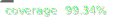

# Eventiq



[](https://bundlephobia.com/package/@tioniq/eventiq)


**Eventiq** is a combination of [Observer](https://en.wikipedia.org/wiki/Observer_pattern)
and [Dispose](https://en.wikipedia.org/wiki/Dispose_pattern) patterns. The library provides a simple and flexible API
for observing events and changes in variables. It's designed to be easy to use and understand, making it ideal for
building reactive applications

The library consists of two main objects:

- `EventObserver` - An object to observe events.
- `Variable` - An object to observe changes in a variable's value.

> **Note:** You can find the complete list of classes and methods in the [type definitions](dist/index.d.ts) file.
> However, for a deeper understanding, we recommend exploring the [source code](https://github.com/tioniq/eventiq), as
> it’s straightforward and easy to follow.

## Installation

To install the package, run the following command:

```bash
npm install @tioniq/eventiq
```

### EventObserver

EventObserver allows you to subscribe to events and receive notifications when those events occur. Every subscription
returns a disposable object, which helps manage and unsubscribe from events, preventing memory leaks.

`EventObserver` class declaration example

```typescript
declare class EventObserver<T = void> {
  subscribe(callback: (data: T) => void): IDisposable
}
```

### Variable

`Variable` allows you to observe changes to a value. It's useful when you need multiple parts of your application to
react to variable changes. The difference between `subscribe` and `subscribeSilent` is that the former will call the
callback immediately with the current value and every time the value changes, while the latter will only call the
callback when the value changes.

`Variable` class declaration example:

```typescript
declare class Variable<T> {
  get value(): T

  subscribe(callback: (value: T) => void): IDisposable

  subscribeSilent(callback: (value: T) => void): IDisposable
}
```

Every subscription returns an object that can be used to unsubscribe from the event. It helps to avoid additional
methods for unsubscribing, makes the code more readable, and helps to avoid memory leaks. Using
the [Disposiq](https://npmjs.com/package/@tioniq/disposiq) library you can easily manage subscriptions and dispose of
them when they are no longer needed. Additionally, `Eventiq` is ready for the
upcoming [Explicit Resource Management API](https://github.com/tc39/proposal-explicit-resource-management), which works
in TypeScript since version 5.2.

## EventObserver

The `EventObserver` class itself is very simple. However, it has a lot of extensions and implementations that make it
very powerful. The main idea is to have a simple and flexible API that can be used in different scenarios. Let's see how
it works.

### Basic usage

This example demonstrates how to use the `EventObserver` and `EventDispatcher` classes to dispatch and observe events.

```typescript
import {EventObserver, EventDispatcher} from '@tioniq/eventiq'

// EventDispatcher is a simple implementation of EventObserver that has a method to dispatch events
const dispatcher = new EventDispatcher<number>()

// Dispatcher itself is an observer
const observer: EventObserver<number> = dispatcher

// Subscribe to the event. The callback will be called every time the event is dispatched
const subscription = observer.subscribe((data) => {
  console.log(data)
})

// Let's dispatch an event. The event will be dispatched to all subscribers immediately (if you are using EventDispatcher)
dispatcher.dispatch(1) // Output: 1

// Since the return value of the subscribe method is IDisposable, you can unsubscribe from the event
subscription.dispose()

// Now the callback will not be called
dispatcher.dispatch(2) // No output
```

### Lazy event dispatcher that works only when there are subscribers

This example demonstrates how to use the `LazyEventDispatcher` class to dispatch events only when there are subscribers.

```typescript
import {LazyEventDispatcher} from '@tioniq/eventiq'
import {DisposableAction} from "@tioniq/disposiq";

// LazyEventDispatcher works only when someone is listening
const dispatcher = new LazyEventDispatcher<number>(dispatcher => {
  // This callback is called when the dispatcher becomes active (i.e., has subscribers)
  console.log('Subscribed')

  // Dispatch an event every second
  let counter = 0
  const interval = setInterval(() => dispatcher.dispatch(++counter), 1000)

  // Return a disposable object to clean up when there are no more subscribers
  return new DisposableAction(() => {
    console.log('Unsubscribed')
    clearInterval(interval);
  })
})

// Wait for 5 seconds
await waitTimeout(5000) // No output, as no one is subscribed yet

// Subscribe to the event
const subscription = dispatcher.subscribe((data) => {
  console.log(data)
}) // Output: Subscribed

// Now the dispatcher is active and the events will be dispatched
await waitTimeout(5000) // Output: 1, 2, 3, 4, 5

// Unsubscribe from the event
subscription.dispose() // Output: Unsubscribed

// Now the dispatcher is not active and the events will not be dispatched
await waitTimeout(5000) // No output
```

### EventObserver extensions

The library offers a variety of extensions for the `EventObserver` class, which can be found in the `extensions` file.
Below are a few examples of how to use these extensions.

```typescript
import {EventDisposer} from '@tioniq/eventiq'

// Create an observer
const observer = new EventDisposer<number>()

// Subscribe to to the observer for only one event
observer.subscribeOnce((data) => {
  console.log("subscribeOnce", data)
})

// Subscribe to the observer for events that meet a specific condition
observer.subscribeWhere(data => {
  console.log("subscribeWhere", data)
}, data => data > 5)

// Subscribe once to the observer, but only when the data meets the condition
observer.subscribeOnceWhere(data => {
  console.log("subscribeOnceWhere", data)
}, data => data > 5)

// Map the event data to create a new observer that dispatches transformed data
observer.map(data => `Updated value to ${data}`).subscribe(data => {
  console.log("map", data)
})

// Filter event data to create a new observer that only dispatches data meeting the condition
observer.filter(data => data > 3).subscribe(data => {
  console.log("filter", data)
})

// Dispatch some events
observer.dispatch(1)
// Outputs:
// subscribeOnce 1
// map: Updated value to 1

observer.dispatch(2)
// Outputs:
// map: Updated value to 2

observer.dispatch(3)
// Outputs:
// map: Updated value to 3

observer.dispatch(4)
// Outputs:
// map: Updated value to 4
// filter: 4

observer.dispatch(10)
// Outputs:
// subscribeWhere 10
// subscribeOnceWhere 10
// map: Updated value to 10
// filter: 10

observer.dispatch(20)
// Outputs:
// subscribeWhere 20
// map: Updated value to 20
// filter: 20

// As shown, observers can be extended with various methods to customize behavior
```

### Use Case: UI Component

Eventiq can be helpful in UI components for listening to state changes or handling custom events

```typescript
import {EventObserver, EventDispatcher} from '@tioniq/eventiq'

class ButtonComponent {
  private readonly clickDispatcher = new EventDispatcher<void>()

  get onClick(): EventObserver<void> {
    return this.clickDispatcher
  }

  click() {
    this.clickDispatcher.dispatch()
  }
}

const button = new ButtonComponent()
const clickSubscription = button.onClick.subscribe(() => {
  console.log('Button clicked')
})
button.click() // Output: Button clicked
```

## Variable

The `Variable` class allows you to observe changes in a variable, making it extremely useful when tracking a variable's
state across different parts of your application.

### Basic usage

This example demonstrates how to use the `Variable` class to observe changes of a variable.

```typescript
import {Variable, MutableVariable} from '@tioniq/eventiq'

// Create a variable
const variable = new MutableVariable<number>(0)

// Subscribe to the variable. The callback will be called immediately with the current value and every time the value is changed
const subscription = variable.subscribe((value) => {
  console.log(value)
}) // Output: 0

// Change the value
variable.value = 1 // Output: 1

// Unsubscribe from the variable
subscription.dispose()

// Now the callback will not be called
variable.value = 2 // No output
```

### Using subscribeSilent

The subscribeSilent method allows you to subscribe to changes without receiving an immediate notification of the current
value.

```typescript
import {Variable, MutableVariable} from '@tioniq/eventiq'

// Create a variable
const variable = new MutableVariable<number>(0)

// Subscribe silently to the variable. The callback will NOT be called immediately but only when the value changes
const subscription = variable.subscribeSilent((value) => {
  console.log(value)
}) // No output

// Change the value
variable.value = 1 // Output: 1
```

### Variable extensions

The library provides a variety of useful extensions for the Variable class, allowing you to extend functionality in
powerful ways. Here's a list of some available extensions:

- map - creates a new variable that will convert the variable value to another value
- switchMap - creates a new variable that will convert the variable value to another value using the mapper that returns
  a new variable to subscribe
- or - creates a new variable that will return true if any of the variable values are true
- and - creates a new variable that will return true if all the variable values are true
- invert - inverts the variable value. If the value is true, the new value will be false and vice versa
- with - combines the variable with other variables
- plus - creates a new variable that will return the sum of the variable values
- minus - creates a new variable that will return the difference of the variable values
- multiply - creates a new variable that will return the product of the variable values
- divide - creates a new variable that will return the quotient of the variable values
- and many more! (See the `src/extensions.ts` file for the full list)

## Explicit Resource Management API

The library supports the
upcoming [Explicit Resource Management API](https://github.com/tc39/proposal-explicit-resource-management) that allows
you to manage resources explicitly. Below is an example of how to utilize this feature.

```typescript
import {EventObserver, EventDispatcher} from '@tioniq/eventiq'

// Create a resource
const resource = new EventDispatcher<number>()

// Create a resource holder
const holder = new EventObserver<number>(resource)

async function observeForFiveSeconds() {
  // Subscribe to the resource using 'using' keyword
  using subscription = holder.subscribe((data) => {
    console.log(data)
  })

  // Wait for 5 seconds
  await waitTimeout(5000)

  // The subscription will be disposed automatically
}

async function dispatchEvents() {
  // Dispatch events every second
  let counter = 0
  const interval = setInterval(() => resource.dispatch(++counter), 1000)

  // 1, 2, 3, 4, 5
  await waitTimeout(10000)

  // Stop dispatching events
  clearInterval(interval)
}

observeForFiveSeconds()
dispatchEvents()
```

## Real-world example

This example demonstrates how to use the `Variable` class to show a shop panel with text and buttons that depend on the
balance variable

```typescript
import {Var, Vary} from '@tioniq/eventiq'
import {DisposableStore, IDisposable} from "@tioniq/disposiq";

// Create a balance variable with an initial value of 100
const balance = new Vary<number>(100)

// Functions to deposit and withdraw money
function deposit(amount: number) {
  balance.value += amount
}

// Create a function to withdraw money
function withdraw(amount: number) {
  balance.value -= amount
}

// Show the shop panel. The function returns a disposable object to manage panel and subscriptions cleanup
function showShopPanel(): IDisposable {
  // Create a disposable store to manage subscriptions
  const disposableStore = new DisposableStore()

  const panel = document.getElementById('shop-panel')
  const depositButton = document.getElementById('deposit')
  const withdrawButton = document.getElementById('withdraw')
  const balanceView = document.getElementById('balance')
  const buyPhoneButton = document.getElementById('buy-phone')
  const buyCakeButton = document.getElementById('buy-cake')
  const buyAll = document.getElementById('buy-all')

  depositButton.addEventListener('click', () => deposit(10))
  withdrawButton.addEventListener('click', () => withdraw(10))

  // Create mapped variables for representation and conditions
  const balanceRepresentation = balance.map(b => `Balance: ${b}`)
  const canBuyPhone = balance.map(b => b >= 1000)
  const canBuyCake = balance.map(b => b >= 10)
  const canBuyPhoneAndCake = canBuyPhone.and(canBuyCake)

  // Subscribe to variables and update the UI
  disposableStore.add(
    balanceRepresentation.subscribe(b => {
      balanceView.innerText = b
    }),
    canBuyPhone.subscribe(canBuy => {
      buyPhoneButton.disabled = !canBuy
    }),
    canBuyCake.subscribe(canBuy => {
      buyCakeButton.disabled = !canBuy
    }),
    canBuyPhoneAndCake.subscribe(canBuy => {
      buyAll.disabled = !canBuy
    })
  )

  // Show the panel
  panel.style.display = 'block'

  // Hide the panel when the disposable store is disposed
  disposableStore.add(() => {
    panel.style.display = 'none'
  })

  return disposableStore
}

// Handle the shop button click event
function handleShopButtonClick() {
  const panelSubscriptions = showShopPanel()
  const closeButton = document.getElementById('close-shop')
  closeButton.addEventListener('click', () => {
    panelSubscriptions.dispose()
  })
}

document.getElementById('shop-button').addEventListener('click', handleShopButtonClick)
```

## Contributing

Contributions are welcome! If you would like to contribute, please feel free to open an issue or submit a pull request
on GitHub. Be sure to write tests for any changes to ensure the library remains stable and reliable.

## License

This project is licensed under the MIT License. For more details, please refer to the [LICENSE](LICENSE) file.